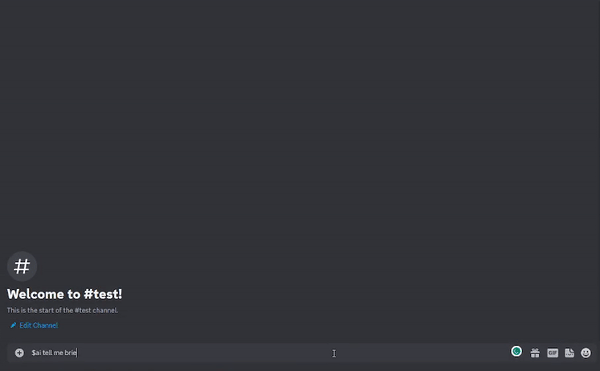

    

 

<h1 style="text-align: center;"> Nahida Bot </h1>

 Genshin AI helper and chatbot 

    <a href="#overview" style="padding: 0px 5px;"> Overview </a>
    <a href="#commands" style="padding: 0px 5px;"> Commands </a>
    <a href="#permissions" style="padding: 0px 5px;"> Permissions </a>
    <a href="#installation" style="padding: 0px 5px;"> Installation </a>

    

## Overview

> **Nahidabot is currently under development.** It is a simple discord ai chatbot that is designed to answer questions about Genshin Impact, its characters, and weapons. The bot is currently in its early stages.

The bot uses the Openai GPT 3.5 turbo model to accept prompts from the user and receive a reply to their discord server.  

It also makes requests to <a href="https://github.com/theBowja/genshin-db-api">genshin-db-api</a> to create additional prompts if a keyword is detected.

Nahidabot can also post embedded Youtube messages to specific discord channels from the Genshin Impact channel (or any channel you wish).

## Commands

The prefix is $.

ai, chat, gpt
- Allows you to talk to the chatbot.
- Works by making a request to the OpenAI API, the response will be displayed in the channel in which the request was sent.  
  
youtube
- Enables the youtube cog
- Currently uses short polling, the default timer is set to 864s
- Will send an embedded image to desired Discord Channel. Please add it in the secret.env file

Each request made to Youtube's Data API by search is 100 units.  
Since Youtube's Data API v3 has a default quota of 10000 units, it can only make a maximum of 1 reqeust every 14 minutes.

## Permissions

The bot requires one of the following:
- Administrator
- Manage Server
- Manage Channels
- Manage Messages

Bot also requires:
- Send messages
- Embed Links

## Installation

Nahidabot requires MongoDB 3.6 or greater as it uses <a href="https://pypi.org/project/pymongo/">pymongo</a> library to access the database.  

To install: 

- Set up your env variables in /resources/secret.env

- Create a docker image.

- Once the image is created, run a container of the image and make sure port 80, 443 (default mongo port) is open.  

        docker run -d -i -t --name nahidabot -p 80:80 -p 443:443 nahidabot:latest

- Create a seperate container using the latest version of MongoDB and open port 27017. 

        docker run -d --name nahidabotdb -p 27017:27017 mongo:latest

- Create a database called nahida (or whatever database name you wish, make sure this is aligned with your values in the .env file) and collection

        use nahida
        db.createCollection('youtube')

- You will also need to create a new user:
  
        use admin
        db.createUser({user: "youruser", pwd: "yourpassword, roles: [{ role: "readWrite", db: "nahida"}]})

- Make sure in the .env that you have the correct host (can be an IP address) run:

        docker inspect nahidabotdb
